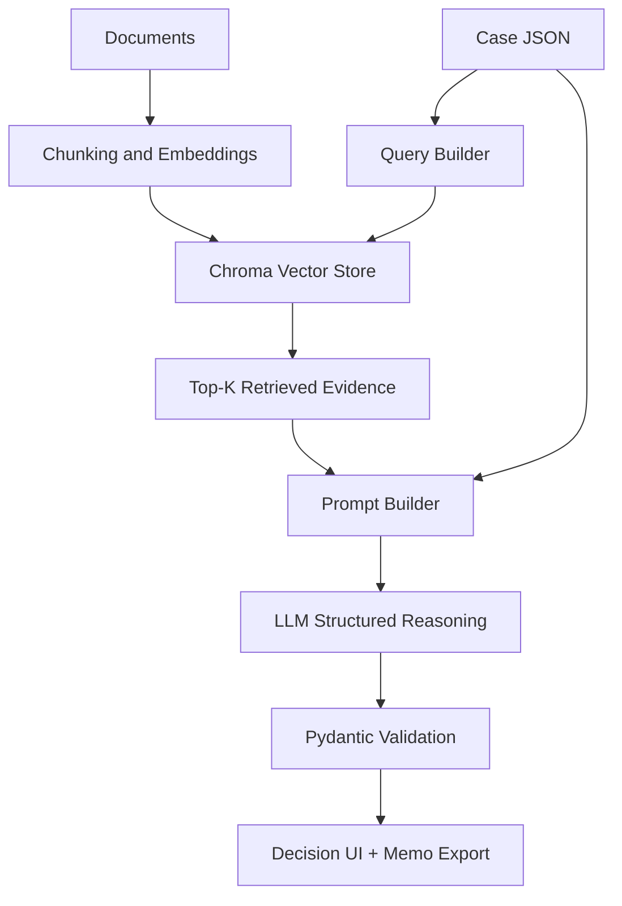

# Decision Intelligence Copilot

Explainable multi-source reasoning AI that turns documents plus case data into a structured recommendation with confidence, evidence, risks, and a generated memo.

## Why this project exists
Teams often make decisions using fragmented inputs: policies, vendor notes, requirements, risk guidance, and free-form case descriptions. This prototype shows how GenAI can be used as a controlled decision-support layer instead of a generic chatbot.

The design focuses on:
- grounded retrieval
- structured outputs
- explicit uncertainty
- source-backed reasoning
- human-in-the-loop review

## Demo capabilities
- ingest markdown, text, or PDF documents
- chunk and index them into a vector store
- retrieve relevant evidence for a case
- generate a typed decision object through a validated schema
- render a memo and export it as markdown
- run through a lightweight Streamlit UI

## Architecture


## Project structure
```text
decision-copilot/
├── app/
│   ├── config.py
│   ├── data_loader.py
│   ├── main.py
│   ├── memo_generator.py
│   ├── prompts.py
│   ├── reasoning.py
│   ├── retriever.py
│   ├── schemas.py
│   └── ui.py
├── data/
│   ├── cases/
│   └── documents/
├── docs/
├── .env.example
├── Dockerfile
├── README.md
└── requirements.txt
```

## Quick start
### 1. Create the environment
```bash
python -m venv .venv
source .venv/bin/activate  # On Windows: .venv\Scripts\activate
pip install -r requirements.txt
```

### 2. Add your API key
```bash
cp .env.example .env
```
Then edit `.env` and set `OPENAI_API_KEY`.

### 3. Run the app
```bash
streamlit run app/main.py
```

## How it works
### Retrieval
Documents are loaded from `data/documents`, normalized, chunked, embedded, and stored in Chroma.

### Reasoning
The case JSON becomes the query context. The app retrieves the most relevant chunks and asks the model to return a strict `DecisionOutput` object.

### Output schema
The result contains:
- decision
- confidence
- executive summary
- reasoning bullets
- risks
- missing information
- next steps
- evidence with source ids
- markdown memo

## Sample use cases included
- vendor selection
- hiring decision
- product prioritization

## Why this looks senior-level
This is not positioned as a chatbot. It demonstrates a reusable pattern for controlled GenAI systems:
- retrieval-augmented generation
- schema-first outputs
- explainability through evidence references
- uncertainty handling
- modular services

## Obvious extension ideas
- add user-uploaded documents in the UI
- support re-ranking before generation
- add evaluation harness for output quality
- add role-based review workflow
- export PDF or DOCX memos
- containerize and deploy behind an internal gateway

## Suggested commit history
1. initialize project skeleton
2. add document ingestion and chunking
3. integrate vector retrieval with Chroma
4. define structured decision schema
5. implement LLM reasoning flow
6. add sample case library
7. build Streamlit decision UI
8. add memo export and README

## Notes
- This is a prototype and uses synthetic sample data.
- Human approval should remain mandatory for real-world deployment.
- The retrieval quality depends on document quality and chunking strategy.
